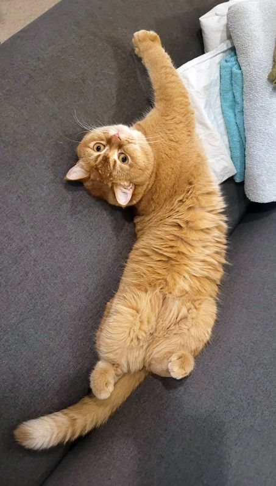

# Pringles' Arctic Time Trucking Co. 🚛❄️🐱

> "Time waits for no cat, especially when they're upside down" - Pringles, Arctic Route Veteran

## About

Welcome to **Pringles' Arctic Time Trucking Co.**! This is a fun, non-commercial software engineering experiment designed to track time in the most purr-fessional way possible.

Inspired by the real-life Pringles (pictured above), a cat who allegedly abandoned a promising career in professional gymnastics to haul cargo across the frozen tundra. Or maybe he just likes napping on the sofa. We may never know the truth.

## Features

- **Time Tracking**: Log your hours on the ice roads (or at your desk).
- **Project Management**: Organize your deliveries (tasks) by client.
- **Offline First**: Uses your browser's LocalStorage and IndexedDB. No cloud, no tracking, just you and the open road.
- **Cat-Themed UI**: Because everything is better with paws.
- **Multi-Language Support**: English, German, and Finnish (for those authentic arctic vibes).

## Tech Stack

- **Vanilla JavaScript**: No frameworks, just pure JS modules.
- **Tailwind CSS**: Precompiled and included as `tailwind.css` (no CDN dependency).
- **IndexedDB**: For robust local data storage.

## Installation / Usage

1. Clone this repository.
2. Open `index.html` directly in your favorite modern web browser.
3. Alternatively, upload the files to any standard web server - no build steps or backend required.
4. Start trucking!

## License

This project is licensed under the MIT License - see the [LICENSE](LICENSE) file for details.

## Author

**Oliver Heggelbacher**  
[www.kickdrive.de](https://www.kickdrive.de)

*This website is a fun, non-commercial software engineering experiment.*

*Tiny disclaimer:
The photo of our cat Pringles (above) is entirely real. The illustrations, music, and a suspicious portion of the code, however, were created with the help of "AI" — which may or may not be a modern, respectable way of saying that additional cats were involved. Interpret as you see fit.*
